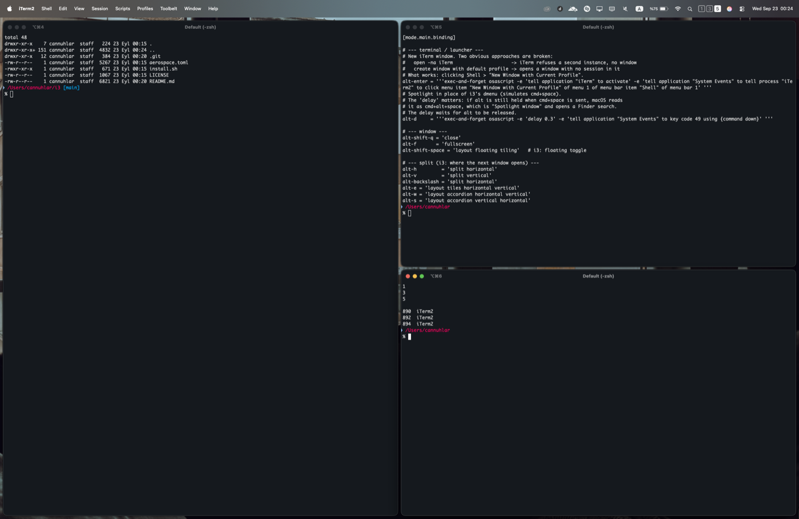

# aerospace-i3-config

An [AeroSpace](https://github.com/nikitabobko/AeroSpace) config that maps i3's keybindings onto macOS, as faithfully as AeroSpace allows.

This is **not a fork** — it is a drop-in `~/.aerospace.toml`. Install AeroSpace the normal way, symlink this config, done.

`mod` is **alt** (i3's Mod1). `cmd` is deliberately left untouched so macOS shortcuts (`cmd+w`, `cmd+f`, `cmd+s`, `cmd+tab`, copy/paste) keep working — see [Why not cmd?](#why-not-cmd).



*Three windows on workspace 5: one split horizontally, then the right side split vertically. The workspace indicator sits in the menu bar.*

## Install

```sh
brew install --cask nikitabobko/tap/aerospace

git clone https://github.com/CNuhlar/aerospace-i3-config.git
cd aerospace-i3-config
./install.sh
```

`install.sh` backs up any existing `~/.aerospace.toml`, symlinks this one in its place, and reloads AeroSpace.

Then grant AeroSpace **Accessibility** permission (System Settings → Privacy & Security → Accessibility). Without it the app runs but manages nothing.

## Keybindings

`mod` = `alt`

### Windows

| Key | Action |
|---|---|
| `mod+enter` | new terminal window |
| `mod+d` | Spotlight (i3's dmenu slot) — always gives a new window |
| `mod+shift+q` | close window |
| `mod+f` | fullscreen — or leave macOS' own fullscreen, see below |
| `mod+shift+space` | toggle floating |

### Focus and movement

i3's default finger layout — `j k l ;` rather than `h j k l`, because `h` is taken by split. Arrow keys work everywhere too.

| Key | Action |
|---|---|
| `mod+j` / `k` / `l` / `;` | focus left / down / up / right |
| `mod+shift+j` / `k` / `l` / `;` | move window left / down / up / right |
| `mod+ctrl+j` / `;` | focus monitor left / right |
| `mod+ctrl+shift+j` / `;` | move window to monitor left / right |

### Layout

| Key | Action |
|---|---|
| `mod+h` (or `mod+\`) | split horizontal |
| `mod+v` | split vertical |
| `mod+e` | tiling layout |
| `mod+w` | tabbed layout (accordion) |
| `mod+s` | stacking layout (accordion) |

### Workspaces

| Key | Action |
|---|---|
| `mod+1` … `mod+0` | switch to workspace 1–10 |
| `mod+shift+1` … `mod+shift+0` | move window to workspace 1–10 |
| `mod+tab` | back and forth |
| `mod+shift+tab` | move workspace to next monitor |

### Modes

| Key | Action |
|---|---|
| `mod+r` | resize mode |
| `mod+shift+e` | exit mode (`y` quits AeroSpace, `n` cancels) |
| `mod+shift+c` | reload config |

In resize mode: `j` / `k` / `l` / `;` and arrows resize, `shift` + those resize in smaller steps, `b` balances sizes, `enter` or `esc` returns to normal mode.

Horizontal resize is intentionally inverted relative to i3's default (`j`/← grows, `;`/→ shrinks). Flip the signs in `[mode.resize.binding]` if you prefer i3's direction. Note that either way it can feel backwards: `resize width` grows the **focused window**, not "push the divider this way", so the divider moves in opposite directions depending on which side of the split you are on. AeroSpace has no directional divider command.

## Two behaviours beyond plain i3

### `mod+f` also escapes macOS' native fullscreen

A window put into macOS' own fullscreen with the green button is off in its own Space where AeroSpace cannot tile it, and AeroSpace's `fullscreen` toggle does not bring it back. `mod+f` handles both cases:

```toml
alt-f = '''exec-and-forget /bin/bash -lc 'aerospace macos-native-fullscreen off --fail-if-noop || aerospace fullscreen' '''
```

`--fail-if-noop` is what makes it work: it exits non-zero when there was nothing to turn off, so the `||` falls through to the normal toggle. In native fullscreen, `mod+f` drops you back into the tiling layout and stops there.

### Activating an app no longer drags you to another workspace

By default, activating an app follows its window: if Safari's only window is on workspace 3 and you hit Spotlight from workspace 1, AeroSpace moves you to workspace 3. `scripts/focus-guard.sh`, wired up as `on-focus-changed`, keeps you put and gives the app a **new window on the workspace you are on**.

How it knows the difference between your own workspace switch and an app jump: every binding that changes workspaces goes through `scripts/ws-goto.sh`, which records the intended workspace *before* switching. When focus lands somewhere that was not asked for, the guard takes over.

Two details make it feel instant rather than like a round trip:

**Going back happens first.** AeroSpace has already moved you by the time any callback runs, so the detour cannot be prevented — only made short. The guard switches back before it does anything else, and asks for the new window afterwards. Measured on the jump it was written for: 75 ms on the wrong workspace, a flicker rather than a visible trip.

```
open -a Safari        t+0ms
  -> workspace 3      t+47ms    (AeroSpace follows the app)
  -> workspace 2      t+122ms   (guard puts you back)
```

**The new window is requested through the app's own File menu**, not with `cmd+N`. By the time the guard asks, you are already back home and the app is no longer frontmost — a keystroke would land in whatever window is now in front. Clicking `File > New Window` in the Accessibility API targets that process directly and works while it sits in the background. The scan — shared by the guard and the launcher, in `scripts/lib.sh` — looks through the File menu (also Shell, for terminals) for an item whose name contains both "New" and "Window", which covers "New Window", "New Finder Window" and "New Window with Current Profile" alike.

### Launching an app you already have open gives a new window

Spotlight raises an app's existing window rather than making a new one, which is the opposite of what a launcher key should do in a tiling setup: `mod+d`, "safari", enter, and you wanted a second window, not the one you were already looking at.

`mod+d` therefore goes through `scripts/launcher.sh`, which opens Spotlight and then watches it. Spotlight never reports what it did, so the script reads the panel directly: every 120 ms it takes the query text and the name of the **highlighted result** — the app Return would open. When the panel disappears it knows both what was asked for and what was in front beforehand, and decides within the next second:

- window count went up → the app made its own window, nothing to do;
- the highlighted app is now in front and the count did not move → Spotlight raised an existing window, so ask that app for a new one and focus it;
- focus is somewhere else entirely → not our launch, leave it alone.

Reading the highlight is what makes the last case safe. An earlier version left a note saying "a launch may be in flight" and let the focus guard claim the next app change within ten seconds — which meant that switching workspaces right after launching something opened a stray window of whatever you landed on, usually a terminal. Nothing is claimed now that was not aimed at.

Dismissing the panel has to stay free, and that needs one more reading: Spotlight reopens holding your **last search, fully selected**. Left alone it stays selected; the first keystroke replaces it. So the probe also asks whether the selection still covers the whole field — if it does, nobody typed here and whatever is in the box is a leftover, not a request. Without that, pressing `mod+d` and changing your mind would open a window of whatever you searched for a minute ago.

It also knows when *not* to act:

- **Closing a window never reopens it.** Closing the last window an app has on this workspace hands focus to that app's window somewhere else, which looks exactly like an activation from the outside. Answering that with a new window means the app springs back every time you close it. The guard compares the total window count against the previous focus change: if it went down, this was a close, so it only takes you back and stops there.
- **An app that already has a window here just gets focused.** No second, third, fourth window piling up each time you activate it — the goal is not being dragged away, not manufacturing windows.

Things worth knowing before you keep this:

- **Apps with no such menu item fall back to being summoned.** If no new window appears within ~1.2s, the guard moves the app's existing window to your workspace instead, so you are never stranded — but you get the old window, not a fresh one.
- **Accepting a remembered query without retyping it gets you a raise, not a new window.** `mod+d`, return, on the search Spotlight still had in the box reads as an untouched prompt. Type a character and it behaves normally; this is the price of dismissal being free, and dismissal is the far more common move.
- **`cmd+tab` behaves differently.** Switching to an app that lives on another workspace now gives you a new window here rather than taking you there.
- **Switch workspaces via the bindings, not the CLI.** Running `aerospace workspace 3` by hand looks exactly like an app jump to the guard, and it will pull you back. Use `~/.config/aerospace-i3/ws-goto.sh 3` instead.
- **Turn it off any time** with `touch ~/.cache/aerospace-i3/disabled` — no config edit, no reload.
- **Watch it think** with `touch ~/.cache/aerospace-i3/debug`, then `tail -f ~/.cache/aerospace-i3/log`. Every decision either script makes is one line. `rm` the flag to stop.

## macOS gotchas this config works around

These cost real debugging time. They are documented in comments in `aerospace.toml` too.

### `split` silently does nothing

AeroSpace's normalizations flatten the container tree, which makes the `split` command a no-op — `mod+v` then a new window gives you nothing. Both must be off for i3-style splits:

```toml
enable-normalization-flatten-containers = false
enable-normalization-opposite-orientation-for-nested-containers = false
```

The tradeoff is i3's: closing windows can leave stale single-child containers behind. `balance-sizes` (`b` in resize mode) or `flatten-workspace-tree` cleans up.

### Opening a new terminal window

For iTerm2, two obvious approaches fail:

| Approach | Result |
|---|---|
| `open -na iTerm` | no window at all — but a second iTerm **process** is left running |
| `create window with default profile` | window opens with **no session in it** |

What works is clicking the menu item:

```
osascript -e 'tell application "iTerm" to activate' \
  -e 'tell application "System Events" to tell process "iTerm2" to click menu item "New Window with Current Profile" of menu 1 of menu bar item "Shell" of menu bar 1'
```

Using a different terminal? Ghostty, Alacritty and kitty all open a real window with plain `open -na <App>`, so you can replace that binding with a one-liner.

The `open -na` failure is worse than it looks. `-n` asks for a **new instance**: iTerm shows no window but the process stays alive, so every keypress leaves another iTerm behind, each one an extra icon's worth of running app. They also break AppleScript targeting — `tell application "iTerm" to count windows` starts answering from a windowless instance and returns `0`. If you ran such a binding for a while, clean them up by killing every `iTerm2` process that owns no windows:

```sh
# which pid owns which window
aerospace list-windows --all --format '%{window-id} %{app-pid} %{app-name}'
# kill the iTerm2 pids that appear in no row
```

### `mod+d` opened a Finder search window

The binding simulates `cmd+space`. But if `alt` is still physically held when the keystroke fires, macOS sees `cmd+alt+space` — which is "Spotlight window", a Finder search. Hence the `delay 0.3` before the keystroke, which waits for `alt` to be released. Increase it if you hold `mod` for longer than that.

### Workspace indicator in the menu bar

No extra tool needed. AeroSpace ships one: its menu bar icon → **Experimental UI Settings → i3 style ordered** shows non-empty workspaces in ascending order with the active one highlighted, which is the i3bar behaviour most people want.


Workspaces 2 and 4 are empty here, so they are not drawn at all — exactly like i3bar.

Worth knowing: `i3 style grouped` pulls the active workspace to the front behind a separator, `i3 style ordered` keeps strict numeric order. This setting is **not** part of the config file — it lives in AeroSpace's own preferences, so it has to be set again on each machine.

## Why not cmd?

`cmd` is the natural Super/Mod4 analogue, and this config used it briefly. It is not worth it. Binding `mod+1..9`, `mod+w`, `mod+f`, `mod+s`, `mod+h`, `mod+tab` on `cmd` takes away tab switching, close, find, save, hide and the app switcher in every application at once.

`alt` is barely used by macOS, which is also why it is AeroSpace's own default. To switch anyway, replace every `alt-` at the start of a line in `aerospace.toml` with `cmd-`.

## Customising

- **Terminal**: change the `alt-enter` binding.
- **Launcher**: `alt-d` simulates `cmd+space`; point it at Raycast or Alfred if you use one.
- **Gaps**: the `[gaps]` table, currently 8px everywhere.
- **Floating rules**: `[[on-window-detected]]` blocks at the bottom.

`auto-reload-config = true` is set, so saving the file applies it. `mod+shift+c` reloads manually.

## Credits

[AeroSpace](https://github.com/nikitabobko/AeroSpace) by Nikita Bobko — an i3-like tiling window manager for macOS that does not require disabling SIP. This repo is only a config for it.

## License

MIT
